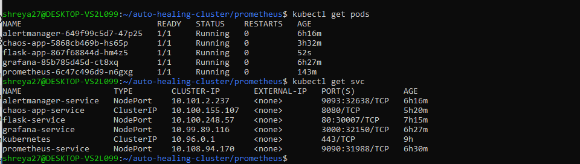
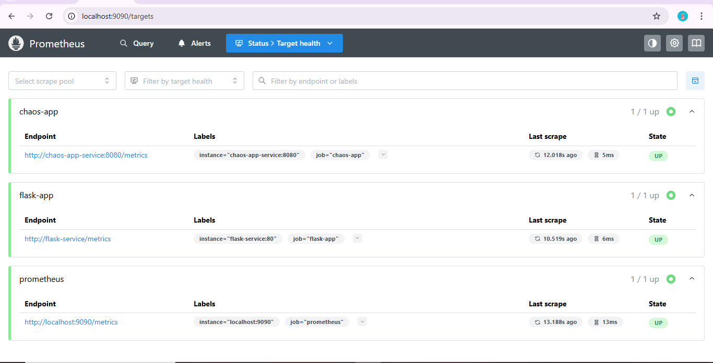
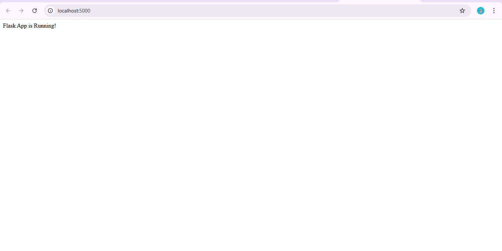
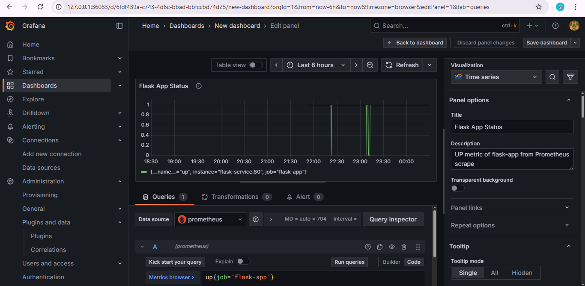
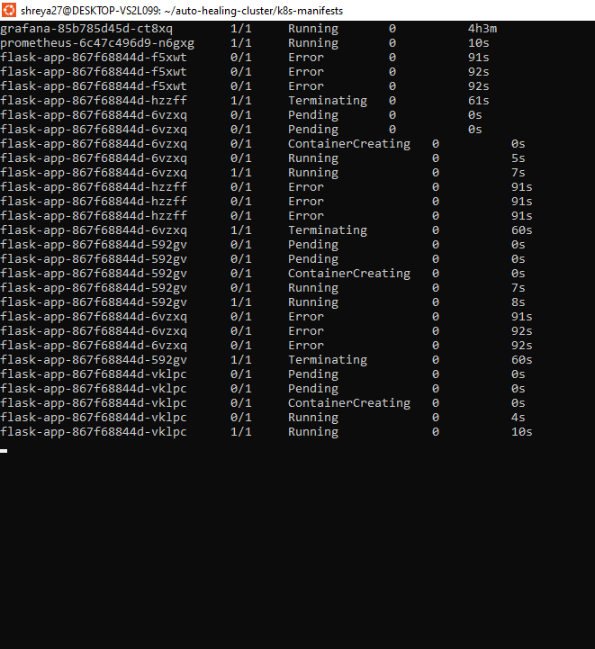
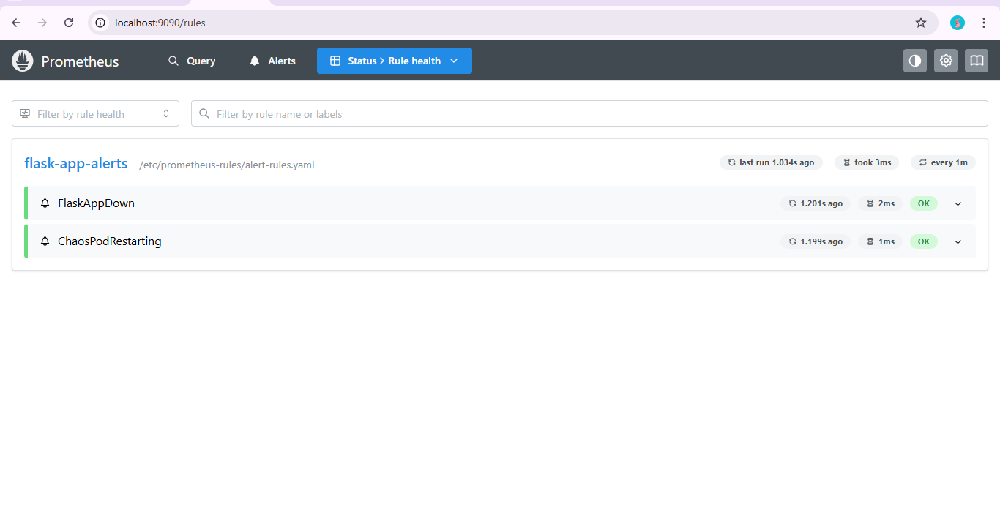
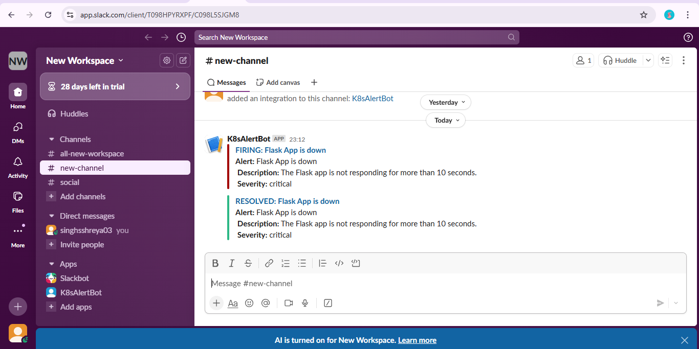

# Self-Healing Kubernetes Cluster with Chaos Monkey Simulation

This project demonstrates a self-healing Kubernetes cluster that simulates real-world failures using a Chaos Monkey-style app, monitors performance with Prometheus and Grafana, and sends alerts to Slack using Alertmanager.

The aim is to showcase resilience and observability in microservices infrastructure, ensuring high availability by automatically recovering from pod failures.

---

## Folder Structure

```
Self-Healing-Kubernetes-Cluster-with-Chaos-Monkey-Simulation/

├── chaos-app/
│   ├── Dockerfile
│   ├── chaos.py
│   └── requirements.txt
│
├── flask-app/
│   ├── Dockerfile
│   ├── app.py
│   └── requirements.txt
│
├── k8s-manifests/
│   ├── alert-rules.yaml
│   ├── alertmanager-config.yaml
│   ├── alertmanager-deployment.yaml
│   ├── chaos-deployment.yaml
│   ├── chaos-service.yaml
│   ├── flask-deployment.yaml
│   ├── flask-service.yaml
│   ├── grafana-deployment.yaml
│   ├── prometheus-alert-rules-configmap.yaml
│   ├── prometheus-config.yaml
│   ├── prometheus-deployment.yaml
│   └── chaos-rbac.yaml
│
├── prometheus/
│   └── prometheus.yml
```

---

## Screenshots

| Screenshot                                           | Description                                         |
| ---------------------------------------------------- | --------------------------------------------------- |
|           | Pods and services running in the Kubernetes cluster |
|          | Prometheus successfully detecting service targets   |
|           | Flask application deployed and accessible           |
|             | Grafana displaying Prometheus metrics               |
|  | Kubernetes auto-healing a deleted pod               |
|   | Prometheus alerting rules configuration             |
|                | Slack receiving real-time alerts from Alertmanager  |

---

## What This Project Demonstrates

* A Flask application running on a Kubernetes cluster.
* A Chaos Monkey simulator that randomly deletes pods.
* Kubernetes' built-in self-healing feature automatically redeploys the failed pods.
* Prometheus scrapes metrics and triggers alerts on pod restarts.
* Alertmanager sends alert notifications to a configured Slack channel.
* Grafana visualizes performance and uptime metrics.

---

## Tech Stack / Tools Used

* **Kubernetes (Minikube)** – Local Kubernetes cluster for running workloads
* **Docker** – Containerizes both Flask and Chaos apps
* **Flask** – Simple Python app to simulate a service
* **Python** – Language used for both Flask and Chaos apps
* **Prometheus** – Metrics collection and alert triggering
* **Grafana** – Metrics visualization and dashboarding
* **Alertmanager** – For routing alerts to Slack
* **Slack** – For receiving real-time alert notifications
* **kubectl** – For cluster and resource management

---

## Business Value

This project showcases how a company can build resilient, observable, and self-healing microservices infrastructure. Key business benefits include:

* **Reduced Downtime**: Automatic pod recovery ensures high availability.
* **Proactive Monitoring**: Prometheus and Grafana offer visibility into system health before outages impact users.
* **Real-Time Alerting**: Slack notifications enable instant incident response, reducing mean time to resolution (MTTR).
* **Chaos Testing Readiness**: The simulated chaos monkey enables teams to validate recovery mechanisms before real failures happen.
* **Operational Excellence**: Emphasizes automation, monitoring, and fault-tolerance—critical for production-grade systems.

---

## Conclusion

This project provided hands-on experience in deploying a fault-tolerant microservice architecture using Kubernetes. It reinforces best practices in DevOps including:

* Resilient design through self-healing mechanisms
* Observability with Prometheus and Grafana
* Alerting via Slack for faster issue resolution

Ideal for DevOps engineers and SREs learning about real-world application reliability in a containerized environment.

---

GitHub Repository
🔗 [Self-Healing Kubernetes Cluster with Chaos Monkey Simulation](https://github.com/shreya-singh27/Self-Healing-Kubernetes-Cluster-with-Chaos-Monkey-Simulation)

